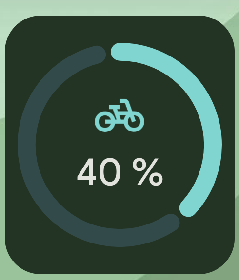

# Spartracker

A Flutter app for saving towards several goals — using **one shared account**
instead of separate jars. You deposit money once, then allocate it freely
across your goals.

Fully offline. No account, no cloud. All data stays on the device.

Available in **English and German**, switchable in the app.

<p>


</p>

*(Amounts blurred out on purpose — these are screenshots of my own, real
savings goals, not sample data.)*

---

## The core idea

Most savings apps keep a separate pot per goal. Spartracker instead separates
**where the money is** from **what it is meant for**:

```
         Deposits                          Allocations
   (birthday, summer job, …)          (reserved for one goal)
              │                                  │
              ▼                                  ▼
      ┌───────────────┐                  ┌────────────────┐
      │Savings account│ ───────────────► │  🚲 Bicycle    │  150 €
      │    300,00 €   │                  ├────────────────┤
      └───────────────┘ ───────────────► │  🎧 Headphones │   50 €
              │                          └────────────────┘
              │
          available: 100 €
```

This produces three numbers that appear throughout the app:

| Value | Meaning |
| --- | --- |
| **Balance** | Sum of all deposits and withdrawals |
| **Allocated** | Sum of money assigned to goals |
| **Available** | Balance − Allocated |

Important: an allocation does not move money, it *reserves* it. The balance
stays the same. Deleting a goal removes only the reservation — the money is
immediately available again.

If more is allocated than the account holds (for example after a later
withdrawal), "available" goes negative. The app shows a warning instead of
quietly glossing over it.

---

## Features

- **Savings account** with a transaction history — deposits and withdrawals
  with a free-text source, date and note
- **Savings goals** with a target amount, symbol and colour; progress shown as
  a ring and a bar
- **Allocate and reclaim** money, with quick picks ("Remaining", "All")
- **Product link with price lookup** — the target amount can be read
  automatically from a product page (see [limits](#price-lookup-what-it-can-and-cannot-do))
- **Delete with undo** for transactions, allocations and whole goals
- **Archive** goals you no longer want in the overview
- **Reset money** — clears all transactions and allocations, keeps the goals
- **73 symbols** in seven categories and eight colours per goal
- **Material You** — the app can follow your system colour (wallpaper on
  Android 12+, accent colour on Windows) or use a colour you pick yourself
- Follows the system light/dark mode
- Locale-aware currency and date formatting (`1.299,00 €` vs `€1,299.00`)
- **Home screen widgets** on Android — see below

---

## Home screen widgets (Android)

Each goal can be pinned to the home screen, in two sizes: a compact ring and a
wider progress card.

<p>
  
</p>

- Added like any Android widget: long-press the home screen → Widgets →
  Spartracker, then pick which goal it should track in a small configuration
  screen.
- Tapping the widget opens that goal in the app.
- If there are no goals yet, the widget shows a hint instead of stale data.
- Widget text follows the **language set in the app**, not the system locale,
  and uses the same number formatting as the rest of the app.
- Colour comes from the goal's own tonal scheme, matching the card in the app;
  the frame follows the system's Material You colours on Android 12+.

Built with **Jetpack Glance** (`androidx.glance`) natively in Kotlin — app
widgets run outside the Flutter engine, so this part of the app is plain
Android. The widget reads goal data that the Flutter side writes out after
every change (see `lib/services/home_widget_service.dart`).

---

## Settings

| Setting | Options |
| --- | --- |
| **System colours** | On — follows wallpaper / system accent. Off — uses the colour you choose. The switch is disabled on devices that provide no system colours. |
| **Your colour** | Eight seed colours; a full tonal scheme is derived from the one you pick. Choosing one turns system colours off automatically, otherwise the choice would have no visible effect. |
| **Language** | System, Deutsch, or English. Applies immediately — no restart. |

Settings live in `shared_preferences`, not in the database: they are needed
before the database is open, and "reset money" must not wipe them.

---

## Tech stack

| Area | Choice | Why |
| --- | --- | --- |
| Framework | Flutter 3.44 / Dart 3.12 | one codebase for mobile and desktop |
| State | [Riverpod](https://riverpod.dev) 2.6 | `StreamProvider` over database streams: the UI updates itself |
| Database | [Drift](https://drift.simonbinder.eu) 2.22 (SQLite) | compile-time checked queries, clean migrations |
| Colours | `dynamic_color` 1.7 | system colours for Material You |
| Translations | `flutter_localizations` + ARB / `gen-l10n` | the standard Flutter approach |
| Settings | `shared_preferences` | small key-value store, available before first frame |
| Price lookup | `http` + `html` | fetch HTML and read structured metadata |
| Home screen widget | Jetpack Glance (Kotlin, Android only) | native `GlanceAppWidget`s, fed by data the app writes on change |

---

## Project layout

```
lib/
├── data/                  Database and access layer
│   ├── database.dart        Tables, schema version, migrations
│   ├── goals_dao.dart       Goals (incl. delete with restore)
│   ├── account_dao.dart     Transactions, balance, reset
│   └── allocations_dao.dart Allocations
├── l10n/
│   ├── app_en.arb           English source strings
│   ├── app_de.arb           German translations
│   ├── gen/                 Generated — do not edit
│   └── l10n_labels.dart     Translates model keys (symbols, colours)
├── models/
│   └── goal_style.dart      Symbol catalogue, colour choices, tonal palettes
├── providers/             Riverpod providers (reactive view of the DAOs)
├── screens/
│   ├── home_screen.dart     Account card + list of goals
│   ├── account_screen.dart  Balance and all transactions
│   ├── goal_detail_screen.dart  Progress and allocations of one goal
│   └── settings_screen.dart Colours and language
├── services/
│   ├── price_lookup.dart    Price extraction from product pages
│   └── home_widget_service.dart  Writes goal data for the Android widgets
├── settings/
│   └── app_settings.dart    Settings model and persistence
├── theme/
│   ├── app_theme.dart       Material 3 theme
│   └── tokens.dart          Spacing/shape tokens, window size classes
├── utils/format.dart      Locale-aware money and date formatting
└── widgets/               Cards, list tiles, bottom sheets
```

Layers are deliberately separate: widgets know nothing about the database,
DAOs know nothing about Flutter. Providers sit in between.

Note that no layer below the UI holds user-facing text. Even the price lookup
returns a typed error reason rather than a message — the UI decides the
wording and the language.

---

## Getting started

Requires the [Flutter SDK](https://docs.flutter.dev/get-started/install) 3.44
or newer.

```bash
flutter pub get

# Generate Drift code (needed after every change to database.dart)
dart run build_runner build

flutter run
```

Translations are generated automatically by `flutter pub get` and `flutter run`
(`generate: true` in `pubspec.yaml`). To regenerate them on their own:

```bash
flutter gen-l10n
```

Tested on **Android** and **Windows**. The other platform folders exist but are
unverified — and **web** will not work as-is: Drift needs a separate SQLite
WASM setup that is not included here.

### Adding a language

1. Copy `lib/l10n/app_en.arb` to `lib/l10n/app_<code>.arb` and translate the
   values.
2. Add the language to `AppLanguage` in `lib/settings/app_settings.dart`.
3. Run `flutter gen-l10n`.

`test/goal_style_test.dart` then checks the new language automatically: it runs
over every supported locale and fails if a symbol, group or colour is missing a
translation.

---

## Data and storage location

The database lives in the app's private directory:

| Platform | Path |
| --- | --- |
| Android | `/data/data/com.spartracker.spartracker/app_flutter/spartracker.sqlite` |
| Windows | `%USERPROFILE%\Documents\spartracker.sqlite` |

Each device has its **own** database — there is no sync between phone and PC.

On a debug build you can pull the Android file with:

```bash
adb exec-out run-as com.spartracker.spartracker \
  cat app_flutter/spartracker.sqlite > spartracker.sqlite
```

### Schema history

| Version | Change |
| --- | --- |
| 1 | Entries were attached directly to a goal |
| 2 | Moved to a central account: every old entry became a transaction **and** an allocation, so both balance and goal progress survived |
| 3 | Symbols moved from emoji to Material icons; a stable key (`bike`) is stored instead of an icon code point |

On version 3: storing a code point would mean building `IconData` at runtime,
which stops Flutter from tree-shaking the icon fonts and breaks the release
build. Debug builds never reveal this — hence the key.

Migrations are covered by tests that create a real database in the old schema
and run the full v1 → v2 → v3 path.

---

## Price lookup: what it can and cannot do

You can attach a product link to a goal; the app reads the price from it and
fills in the target amount.

**It reads**, in this order:

1. JSON-LD following `schema.org/Product` (including nested `@graph`)
2. Meta tags: `product:price:amount`, `og:price:amount`
3. Microdata: `itemprop="price"`

Both German and English number formats are understood (`1.299,00 €` and
`1,299.00`).

**It will not work** when a shop renders the price via JavaScript or blocks
automated access — Amazon usually does both. In that case a clear message
appears and you enter the price yourself. A guessed value is **never** used.

---

## Tests

```bash
flutter analyze
flutter test
```

Currently **58 tests**:

| File | Covers |
| --- | --- |
| `migration_test.dart` | Schema migrations against a real SQLite file; money released on delete, undo, reset, cascade |
| `price_lookup_test.dart` | Price extraction against a fake HTTP client, including blocking, missing price and broken JSON-LD |
| `settings_test.dart` | Defaults, persistence across restarts, and that picking a colour turns system colours off |
| `adaptive_layout_test.dart` | Window size classes, page margins, content width cap |
| `goal_style_test.dart` | Symbol catalogue and its translations in every supported language |
| `widget_test.dart` | Start-up smoke test plus German and English rendering |

---

## Design

The UI follows Material Design 3:

- **Colour** comes from `ColorScheme` roles, never from fixed hex values. Each
  goal derives its own tonal scheme from its colour, aligned towards the app
  colour with `harmonizeWith()` — green stays green but fits the rest.
- **Depth** comes from tonal surfaces, not shadows.
- **Spacing and shape** come from `theme/tokens.dart` (4dp grid, MD3 shape
  scale) rather than scattered numbers in widget code.
- **Adaptive**: margins follow the window size class; on wide windows content
  is capped at 840dp and centred instead of stretching across the screen.
- **Accessibility**: touch targets are at least 48dp; cards, progress rings and
  colour swatches carry meaningful screen-reader labels.

---

## Limits

- No sync between devices, no backup export
- Web is not supported (see above)
- The price lookup is deliberately best-effort and is no substitute for a shop API
- "Reset money" cannot be undone — unlike deleting individual entries
